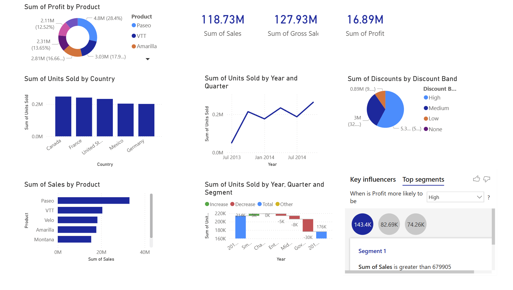

# 📊 Business Data Analytics Portfolio

## 📖 Project Overview
This repository hosts my portfolio projects from the **Business Data Analytics Masterclass** at Brit College of Engineering & Technology. The goal of these projects was to transform raw business data into interactive, visual narratives that drive strategic decision-making.

I utilized **Microsoft Power BI** for financial performance analysis and **Tableau** for global supply chain and logistics tracking.

## 1️⃣ Project: Financial Performance Dashboard (Power BI)

### 🎯 Objective
To analyze the financial health of a global company by tracking sales trends, product profitability, and market segmentation over a two-year period.

### 🖼️ Dashboard Visuals

### 🔍 Key Insights
- **Financial Health:** The company generated **$118.73M** in Total Sales with a Gross Profit of **$16.89M**.
- **Top Performers:** The product **'Paseo'** is the market leader, contributing significantly to the total revenue.
- **Market Segmentation:** The **Government** segment proved to be a critical revenue driver, outperforming other sectors.
- **Seasonality:** A distinct upward trend in unit sales was observed towards the end of 2014, suggesting strong Q4 performance.
- **AI Analytics:** Using the 'Key Influencers' visual, I identified that specific discount bands are strong predictors of high profitability.

## 2️⃣ Project: Global Sales & Shipment Dashboard (Tableau)

### 🎯 Objective
To evaluate global logistics efficiency and regional sales performance, focusing on shipment volumes and sales representative benchmarks.

### 🖼️ Dashboard Visuals
[Tableau Dashboard](tabbbb.PNG)

### 🔍 Key Insights
- **Global Performance:** The dashboard tracks a total revenue of **$6.18M** generated from **177,007 boxes shipped**, indicating a high-volume global operation.
- **Top Markets:** **Australia** is identified as the leading country for sales revenue, followed closely by the **UK** and **India**, suggesting these are the most critical regions for expansion.
- **Top Talent:** The sales performance ranking highlights **Ches Bonnell** as the top-performing sales representative, setting the benchmark for the team.
- **Product Demand:** Segmentation analysis reveals distinct regional preferences for specific categories, such as **'70% Dark Bites'**, which dominate shipment volumes in key territories.

## 🛠️ Tools & Technologies Used
* **Microsoft Power BI:** Data Modeling, DAX (Calculated Measures), AI Visuals.
* **Tableau:** Geospatial Mapping, Interactive Dashboards.
* **Power Query:** Data Cleaning & ETL (Extract, Transform, Load) processes.
* **Microsoft Excel:** Raw data management and preparation.

## 🚀 Conclusion
These projects demonstrate the ability to handle diverse datasets—from financial ledgers to shipping logs—and translate them into actionable business intelligence. By integrating **Power BI’s** analytical depth with **Tableau’s** visualization capabilities, I was able to identify cost-saving opportunities and growth areas effectively.
